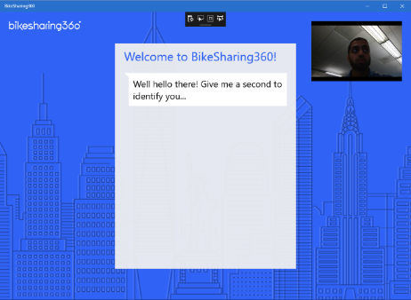
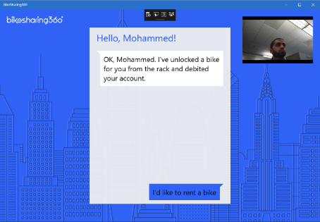

# BikeSharing360 Modern Kiosk with Cognitive Services

During Connect(); //2016 we showcased many technologies available to you as a developer across Azure, Office, Windows, Visual Studio and Visual Studio Team Services. We’ve also heard from you that you love to have real-world applications through which you can directly experience what’s possible using those technologies. This year, then, we built out a full bikerider scenario for our Connect(); //2016 demos and are delighted to share all the source code with you.

**Note:** This document is about the **Kiosk app** only.

This kiosk app leveraged Cognitive Services to enable customers to interact with the kiosk through face detection, face recognition, voice verification, text-to-speech, speech-to-text, language understanding, and emotion detection, which allowed them to complete a transaction without the need for traditional input or touch or even pulling out your wallet.  

## Requirements
* Windows 10
* [Visual Studio __2015__](https://www.visualstudio.com/en-us/products/vs-2015-product-editions.aspx) Update 3 (14.0 or higher) to compile C# 6 language features (or Visual Studio MacOS)
* Microsoft Azure subscription

## Screens

## Setup
**Download** or clone the repository. 

	1. Create an Azure account if you don't already have one using the steps in the next section of this README.
	2. Create Cognitive Services Keys for:
		a. Face SDK
			i. In Azure portal, click + New button
			ii. Type "Cognitive Service APIs" in the search box
			iii. Click  Cognitive Service APIs (preview) in search result
			iv. Click Create button
			v. Give a unique name to the Account Name field (for example, "FaceApiAccount")
			vi. Click Api type to configure required settings
			vii. Pick Face API (preview) from the list of services
			viii. Click Pricing tier to select a proper pricing tier
			ix. Set proper Resource Group option
			x. Click Legal terms to review and agree on the terms
			xi. Click Create button
			xii. Shortly you should receive a notification if the deployment succeeds. Click on the notification should bring you to the service account you just created
			xiii. Click on Keys and take a note of either one of the two keys.
		b. Voice Verification SDK
			i. Similar to how you create the Face Api service, but this time, pick Speacker Recognition APIs (preview) from the list of services.
			ii. Also take note of either one of the two keys.  We will need it in the later steps.
	3. Set up a LUIS model 
		a. See instructions on setting up the LUIS model from the BOT sample project found here: https://github.com/Microsoft/BikeSharing360_BotApps/blob/master/README.md
	4. Create a face verification profile for yourself
		a. Clone the repository https://github.com/Microsoft/Cognitive-Face-Windows
		b. Open Sample-WPF\Controls\FaceIdentificationPage.xaml.cs, change Line 67
		
		        public static readonly string SampleGroupName = Guid.NewGuid().ToString();
		
		to have a more user-friendly name, instead of a GUID
		
		c. Follow the instruction in README.md to build the sample
		d. Run the sample
		e. Click on Subscription Key Management tab, paste in the Face API key you saved earlier
		f. The sample comes with a set of training data under Data/PersonGroup folder in the repository, create a new folder (with a name of your choice), and copy one or more of your profile images into that folder.  Frontal or near-frontal face works the best. Delete other folders in the example data set to reduce the api calls to your Face Api service
		g. Click on Face Identification tab
		h. Click Load PersonGroup button
		i. Select the Data/PersonGroup folder on your local disk
		j. If any of your profile images contains a valid face, the image will show up.  It means your Face profile is registered successfully.
		k. The status pane should also contain the face profile id for each person, take note of your face profile id. Example log:
		
		[12:22:42.547589]: Response: Success. Person "Family1-Dad" (PersonID:9acfe7e1-6196-4230-aed8-a0b172ee2298) created
		[12:22:43.913174]: Request: Creating person "Family1-Daughter"
		[12:22:44.228009]: Response: Success. Person "Family1-Daughter" (PersonID:c32d0abe-ef03-40fc-b50d-66c989a9957e) created
		
		l. You need the group name, and the Face profile Id  
		
	5. Create a voice verification profile for yourself
		a. Clone the repository https://github.com/Microsoft/Cognitive-SpeakerRecognition-Windows
		b. Follow the instruction in README.md to build Verification/SPIDVerficationAPI_WPF_Sample.sln
		c. Run the sample
		d. Paste your Speacker Recognition account key in the Subscription Key Management tab
		e. Click on Scenario 1: Make a new Enrollment tab
		f. Pick one phrases from the ten available phrases
		g. Click Record button then start speaking your chosen phrase via microphone. Click Stop Recording after wards, the status pane should show your phrase if everything works as expected
		
		[12:02:22.651469]: Your phrase: <XXX XXX X XXX>
		
		h. The sample code doesn't show you the Speaker profile id in the status pane.  To work around it, you can click Reset Profile button as soon as it's enabled, the application  will show a message similar to the below in the status pane. Take note of this id.
		
		[12:07:03.877365]: Resetting profile: 54aa9c1d-a815-44b6-9696-26be765dd840
		
		i. Repeat the recoding/stop recording using your chosen phrase until Remaining Enrollments reaches 0.
		j. You need the Speaker profile Id.
		
	6. Open the BikeSharing.Clients.CogServicesKiosk.sln solution
		a. Update the Cognitive Services keys in the App.xaml.cs
		b. Add a row representing yourself in the constructor of the Data\UserLookupServices.cs class
Build and run the application

## Running the demo
You can find the steps to run through the demo script by clicking <a href="Documents/Script.docx">HERE</a>.

Enjoy!

## How to sign up for Microsoft Azure

You need an Azure account to work with this demo code. You can:

- Open an Azure account for free [Azure subscription](https://azure.com). You get credits that can be used to try out paid Azure services. Even after the credits are used up, you can keep the account and use free Azure services and features, such as the Web Apps feature in Azure App Service.
- [Activate Visual Studio subscriber benefits](https://www.visualstudio.com/products/visual-studio-dev-essentials-vs). Your Visual Studio subscription gives you credits every month that you can use for paid Azure services.
- Not a Visual Studio subscriber? Get a $25 monthly Azure credit by joining [Visual Studio Dev Essentials](https://www.visualstudio.com/products/visual-studio-dev-essentials-vs).

## Blogs posts

Here's links to blog posts related to this project:

- Xamarin Blog: [Microsoft Connect(); 2016 Recap](https://blog.xamarin.com/microsoft-connect-2016-recap/)
- The Visual Studio Blog: [Announcing the new Visual Studio for Mac](https://blogs.msdn.microsoft.com/visualstudio/2016/11/16/visual-studio-for-mac/)
- The Visual Studio Blog: [Introducing Visual Studio Mobile Center (Preview)](https://blogs.msdn.microsoft.com/visualstudio/2016/11/16/visual-studio-mobile-center/)
- The Visual Studio Blog: [Visual Studio 2017 Release Candidate](https://blogs.msdn.microsoft.com/visualstudio/2016/11/16/visual-studio-2017-rc/)

## Clean and Rebuild
If you see build issues when pulling updates from the repo, try cleaning and rebuilding the solution.

## Copyright and license
* Code and documentation copyright 2016 Microsoft Corp. Code released under the [MIT license](https://opensource.org/licenses/MIT).

## Code of Conduct 
This project has adopted the [Microsoft Open Source Code of Conduct](https://opensource.microsoft.com/codeofconduct/). For more information see the [Code of Conduct FAQ](https://opensource.microsoft.com/codeofconduct/faq/) or contact [opencode@microsoft.com](mailto:opencode@microsoft.com) with any additional questions or comments.
